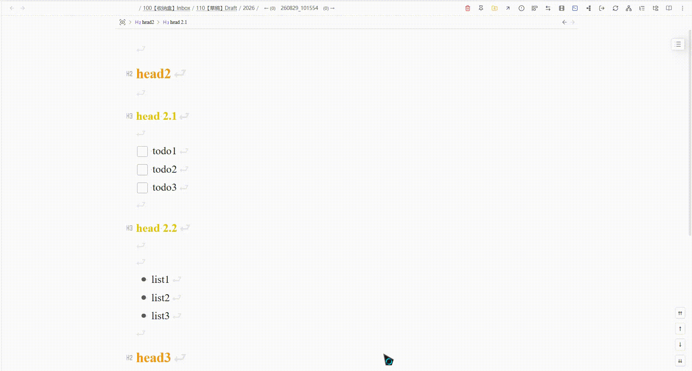
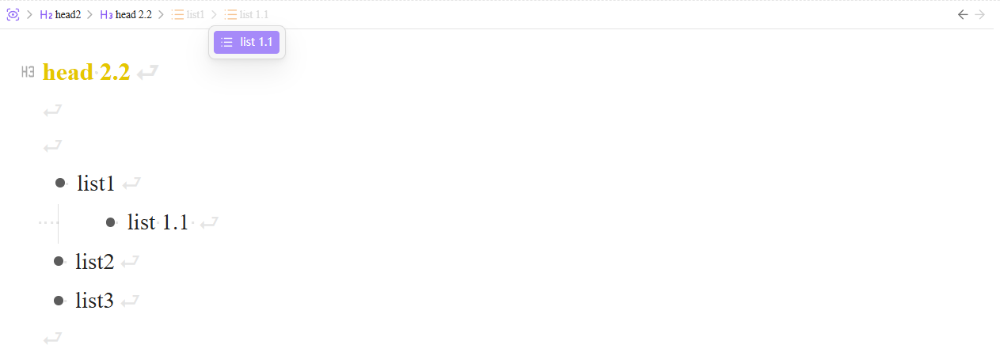

# Quick Zoom

- [中文说明](#中文说明)
- [English](#English)

---

## 中文说明

Quick Zoom 支持快速缩放到标题与列表，提供顶部粘性导航栏、大纲菜单，以及父节点 / 同级 / 标题等快捷键导航。

### 参考来源

本插件基于 [Viacheslav Slinko](https://github.com/vslinko) 的 **[Obsidian Zoom](https://github.com/vslinko/obsidian-zoom)** 二次开发。

### 演示



### 安装

#### 使用 BRAT（推荐）

1. 安装社区插件 [Obsidian42 - BRAT](https://github.com/TfTHacker/obsidian42-brat)
2. 打开 **设置 → BRAT → Beta Plugin List → Add Beta plugin**
3. 填入仓库地址：`https://github.com/PandaNocturne/obsidian-quick-zoom`
4. 在 **设置 → 第三方插件** 中启用 **Quick Zoom**

#### 手动安装

从 [最新发布](https://github.com/PandaNocturne/obsidian-quick-zoom/releases/latest) 下载 `main.js`、`manifest.json`、`styles.css`，放入：

```
<vault>/.obsidian/plugins/quick-zoom/
```

在 **设置 → 第三方插件** 中启用 **Quick Zoom**。

> 需在 **设置 → 编辑器** 中启用 **折叠标题** 与 **折叠缩进**。

### 功能

#### 核心缩放

- 缩放到标题、列表、段落或选区，隐藏其余内容
- 点击列表标记缩放（可关闭）
- 缩放前进 / 后退历史

#### 导航栏

- 缩放时顶部粘性面包屑；可选默认模式显示
- 大纲子菜单浏览同级与子级
- 缩放时跟踪光标（低于缩放根的层级虚色显示）
- 可配置导航栏宽度、标题最大宽度与 Markdown 渲染

#### 大纲列表

- 识别无序、有序、任务列表（可分别开关）



#### 缩放状态记录

- 按笔记保存最近一次缩放范围到插件目录 `data/zoom-state.json`
- 可选：打开笔记时自动恢复上次缩放
- 可配置最大记录笔记数（默认 200，超出淘汰最旧；已删除笔记自动清理）
- 设置中可一键重置全部记录

#### 导航命令

| 命令                  | 默认快捷键             |
| --------------------- | ---------------------- |
| 放大                  | `Ctrl/Cmd + Shift + .` |
| 退出全部缩放          | `Ctrl/Cmd + Shift + /` |
| 缩放过中后退 / 前进   | —                      |
| 缩放到上 / 下一个标题 | —                      |
| 缩放到父节点          | —                      |
| 缩放到上 / 下一个同级 | —                      |

在 **设置 → 快捷键** 中搜索 “Zoom” 自行绑定。

### 设置

打开 **设置 → Quick Zoom**。页面底部标注了原插件来源。

### 许可

MIT — 见 [LICENSE](LICENSE)。  
基于 [Obsidian Zoom](https://github.com/vslinko/obsidian-zoom)（MIT）。

---

## English

Quickly zoom into headings and lists in Obsidian, with a sticky top navigation bar, outline menus, and keyboard commands for parent / sibling / heading navigation.

🐛 [Report issues](https://github.com/PandaNocturne/obsidian-quick-zoom/issues)

### Source

This plugin is a fork of **[Obsidian Zoom](https://github.com/vslinko/obsidian-zoom)** by [Viacheslav Slinko](https://github.com/vslinko).

### Demo


### Install

#### Via BRAT (recommended)

1. Install the community plugin [Obsidian42 - BRAT](https://github.com/TfTHacker/obsidian42-brat)
2. Open **Settings → BRAT → Beta Plugin List → Add Beta plugin**
3. Enter: `https://github.com/PandaNocturne/obsidian-quick-zoom`
4. Enable **Quick Zoom** under **Settings → Community plugins**

#### Manual install

Download `main.js`, `manifest.json`, and `styles.css` from the [latest release](https://github.com/PandaNocturne/obsidian-quick-zoom/releases/latest), then place them in:

```
<vault>/.obsidian/plugins/quick-zoom/
```

Enable **Quick Zoom** under **Settings → Community plugins**.

> Requires **Fold heading** and **Fold indent** under **Settings → Editor**.

### Features

#### Core zoom

- Zoom into a heading, list, paragraph, or selection — hide everything else
- Click a list bullet to zoom (optional)
- Zoom back / forward history

#### Navigation bar

- Sticky top breadcrumbs while zoomed; optional breadcrumbs in default mode
- Outline submenu for siblings and children
- Track cursor while zoomed (dimmed levels below zoom root)
- Configurable bar width, title max width, and Markdown rendering

#### Outline lists

- Recognize unordered, ordered, and task lists (each toggleable)


#### Zoom state

- Persist the last zoom range per note under the plugin folder `data/zoom-state.json`
- Optionally restore that zoom when reopening a note
- Cap how many notes are kept (default 200; oldest dropped; missing notes cleaned up)
- Reset all saved records from Settings

#### Navigation commands

| Command                         | Default hotkey         |
| ------------------------------- | ---------------------- |
| Zoom in                         | `Ctrl/Cmd + Shift + .` |
| Zoom out                        | `Ctrl/Cmd + Shift + /` |
| Zoom back / forward             | —                      |
| Zoom to previous / next heading | —                      |
| Zoom to parent                  | —                      |
| Zoom to previous / next sibling | —                      |

Assign hotkeys under **Settings → Hotkeys** (search “Zoom”).

### Settings

Open **Settings → Quick Zoom**. A link to the original plugin is shown at the bottom.

### License

MIT — see [LICENSE](LICENSE).  
Based on [Obsidian Zoom](https://github.com/vslinko/obsidian-zoom) (MIT).
